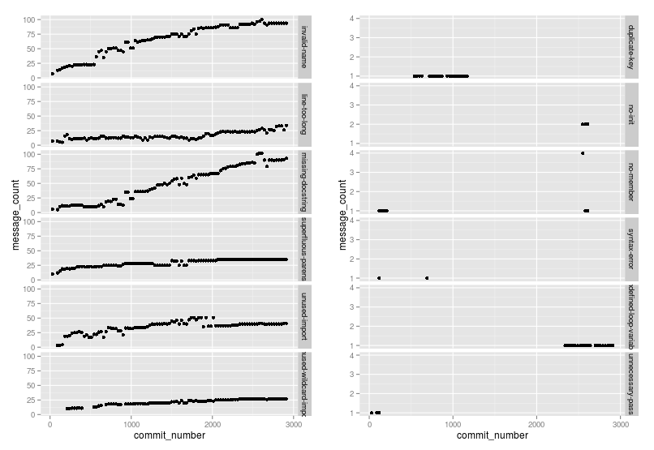

#Analyzing the changes in the coding standards throughout the life cycle of the project.

####Introduction
For each programming language, there are some coding conventions and style guides that are defined, which helps to structure your code and provide better readability. Examples of some of the famous coding standards are [PEP 8](https://www.python.org/dev/peps/pep-0008) for Python and [Oracle's Guide](http://www.oracle.com/technetwork/java/codeconvtoc-136057.html) for Java. Following the coding conventions ensures better code quality and readability. Also, it helps to maintain a consistency in coding pattern throughout the organization. 

In open source projects, it is difficult to maintain these standards as there are many collaborators. This sometimes makes the code hard to understand for new contributors. The goal of this project is to analyze how the coding style changes over the life-cycle of the project. This report provides several analysis of famous git hub repositories taking into account different metrics. 

For most of the languages, there are tools available that scan the code and gives different warnings related to coding styles. The project attempts to identify the type of warnings that occur during different stages of the project. Also, some of the warnings may be less important then others. Apart from observing the nature of these warnings, this analysis tries to provide an efficient way prioritize them.

####Data Collection
In order to collect the sufficient data for my analysis, I have selected below mentioned repositories from github.
The selection is based on 'trending this month' and 'Most forked repositories', for Python language. One can easily search on github based on these 2 criteria.

Selected repositories:

- [Pandas](https://github.com/pydata/pandas.git)
- [Reddit](https://github.com/reddit/reddit.git)
- [Fabric](https://github.com/fabric/fabric.git)
- [Django](https://github.com/django/django.git)
- [Neurokernals](https://github.com/neurokernel/neurokernel.git)
- [Youtube-dl](https://github.com/rg3/youtube-dl.git)
- [Pydub](https://github.com/jiaaro/pydub.git)
- [Tornado](https://github.com/tornadoweb/tornado.git)
- [Scrapy](https://github.com/scrapy/scrapy.git)
- [Ipytho](https://github.com/ipython/ipython.git)
- [Matplotlib](https://github.com/matplotlib/matplotlib.git)
- [Python Koans](https://github.com/gregmalcolm/python_koans.git)

After downloading these repositories, we further collect data by running Pylint on code base. The details of this are described in the coming section.

####Introduction to Pylint
There are several parsers available for different languages that analyze the code for bad coding styles and gives you detailed report. I have used [Pylint](http://www.pylint.org/). Pylint is python based tool that helps in finding these warnings for python language. When you parse a python package using Pylint, it gives you error and warning messages along with their count and position of particular warning message in the code. Some of the uses of Pylint are checking line-code's length, checking if variable names are well-formed according to PEP 8 coding standard, checking if imported modules are used, etc. 

It also provides you a **Normalized score for the code out of 10.0**.

####Analysis of the repositories
In this section, I provide analysis results after running Pylint on projects. 

For each repo, 100 commits are selected as checkpoints. For e.g if you have 5000 commits in the project, you place a checkpoint after each 50 commit. Then Pylint is run on code at each checkpoint. In order to persist the warning dat, we parse the messages given by Pylint and store them in MySQL db.

Below are the two plot - 1. Lines of code at each checkpoint & 2. Overall code score Normalized by Number of lines of code over the life cycle. It can be observed from the plot, that there is very little change in the overall code score throughout the life cycle. Even as the number of lines of code increase, the error messages and warnings also increase along with that.

*Figure 1. Left side plot shows how the number of lines of code increase over the life cycle of [Fabric](https://github.com/fabric/fabric.git) project. Right side plot is the Normalized code score for the same project. It can be seen from this plots that there is very little change in the overall quality of coding standard during the life cycle once the project crosses its first few hundred commits.*

This motivates us to analyze the code on more fine grain level. By checking the error messages at each checkpoint, it was discovered that the nature of errors and warning is diverse. It can be easily deduced from the plot below that there are broadly 2 different types of error messages- there are some that persist throughout the life-cycle of the project and others which appear at some point, and then are fixed.

At each checkpoint, there are large number of error messages. Currently I am showing only top-6 and bottom-6 messages in the below plot for 'fabric' repository. **Similar patterns are observed across all the other repositories also. **

*Figure 2. Left plot shows top-6 messages for 'fabric' project which persists throughout the life cycle of project. Right plot shows bottom-6 error messages for same project. It can be clearly seen that these messages appear and disappear at different instances.*

####Prioritizing warnings based on the above analysis.

This part is extension to the original project. The above analysis gives us motivation to prioritize these warning messages based on there behavior. Since the Pylint and other such tools throw large number of warnings (roughly 50-60 warnings at each commit), it becomes necessary to prioritize them.[1] The idea here is that the warnings that persists throughout the life cycle are probably less important since nobody cares to fix them. Those warnings that appear only at few checkpoints, are high priority since they were fixed by someone. 

Similar work has been done by Sunghun Kim and Michael D. Ernst[1]. But their approach was to compare the code line by line for each consecutive commits. That is computationally very expensive, specially for large projects which have more than 5K commits. The current approach in this project is computationally much more efficient since we are only analyzing the project for 100 chosen checkpoint commits.

* Messages with highest frequency:
    * invalid-name
    * missing-docstring
    * unused-import
    * superfluous-parens
    * unused-wildcard-import
    * line-too-long
* Messages with lowest frequency:
    * syntax-error
    * unnecessary-pass
    * no-init
    * no-member
    * duplicate-key
    * undefined-loop-variable

####Conclusion
Need to get some feedback from professor.

####References

1. [Prioritizing Warning Categories by Analyzing Software History](https://github.ncsu.edu/CSC510-Fall2014/Empirical-CheckStyle/blob/master/papers/Warnings.pdf?raw=true)
